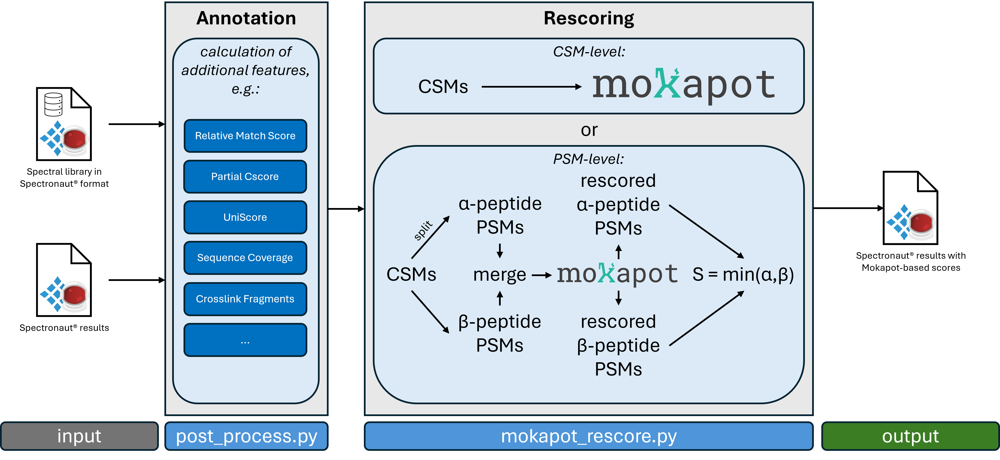

# Rescoring of Spectronaut Crosslinking Results with Mokapot

This repository contains code for rescoring [Spectronaut](https://biognosys.com/software/spectronaut/)
crosslinking spectral library search results,
generated as [proposed here](https://github.com/hgb-bin-proteomics/MSAnnika_Spectral_Library_exporter),
with [Mokapot](https://github.com/wfondrie/mokapot).



## Requirements

- You need annotated and grouped results as returned by [post_process.py](https://github.com/hgb-bin-proteomics/MSAnnika_Spectral_Library_exporter/blob/master/post_process.py)
  as input! These files usually end in the suffix `.csv_annotated.csv_grouped_by_residue_pair.csv`!
- Install [uv](https://docs.astral.sh/uv/getting-started/installation/)!
- Initialize this project by running:
  ```bash
  uv sync
  ```

## Rescoring with Mokapot

You can rescore your results with the following code:
- Launch a python shell with uv:
  ```bash
  uv run python
  ```
- Import the necessary python function:
  ```python
  from mokapot_rescore import rescore
  ```
- Rescore your results, in this case we use example data from the `/data` directory:
  ```python
  df = rescore(
      "data/THIDDIAXL003_DIAmethodEval_SN20c4_Report_FM_crosslinking_plusDecoy_req_DIA12_CV48.csv_annotated.csv_grouped_by_residue_pair.csv"
  )
  ```
- Write out the rescored to a new file:
  ```python
  df.to_csv("rescored.csv", index=False)
  ```
- In this case you get a new result file named `rescored.csv` with an extra column called `Mokapot Score` containing the new scores!
- For more information regarding the `rescore()` function please refer to the [documentation](https://github.com/hgb-bin-proteomics/MSAnnika_Spectral_Library_exporter_rescoring/blob/master/mokapot_rescore.py#L410)!

## Reading Results with pyXLMS

For FDR estimation and down-stream analysis we also provide a parser for [pyXLMS](https://github.com/hgb-bin-proteomics/pyXLMS).
You can read both non-rescored and rescored results with it:
- Launch a python shell with uv:
  ```bash
  uv run python
  ```
- Import the necessary python function:
  ```python
  from pyXLMS_adaptor import read
  ```
- Read the result file, in this case we use example data from the `/data` directory:
  ```python
  pr = read(
      "data/THIDDIAXL003_DIAmethodEval_SN20c4_Report_FM_crosslinking_plusDecoy_req_DIA12_CV48.csv_annotated.csv_grouped_by_residue_pair.csv",
      score="EG.Cscore",
  )
  ```
- You now have a [parser_result](https://github.com/hgb-bin-proteomics/pyXLMS/blob/master/docs/data_types.md#parser-results) that you can use with pyXLMS!
- For more information regarding the `read()` function please refer to the [documentation](https://github.com/hgb-bin-proteomics/MSAnnika_Spectral_Library_exporter_rescoring/blob/develop/pyXLMS_adaptor.py#L29)!

## Manuscript and Figure Code

For the entrapment analysis and figure code we did for the manuscript, please check [this notebook](https://github.com/hgb-bin-proteomics/MSAnnika_Spectral_Library_exporter_rescoring/blob/master/entrapment/entrapment.ipynb).

## Known Issues

[List of known issues](https://github.com/hgb-bin-proteomics/MSAnnika_Spectral_Library_exporter_rescoring/issues)

## Citing

If you are using code from this repository please cite as described [here](https://github.com/hgb-bin-proteomics/MSAnnika_Spectral_Library_exporter?tab=readme-ov-file#citing).

## License

- [MIT](https://github.com/hgb-bin-proteomics/MSAnnika_Spectral_Library_exporter_rescoring/blob/master/LICENSE)

## Contact

- [micha.birklbauer@fh-hagenberg.at](mailto:micha.birklbauer@fh-hagenberg.at)
